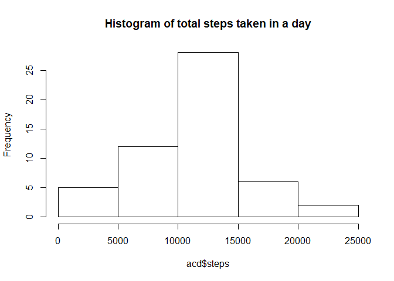
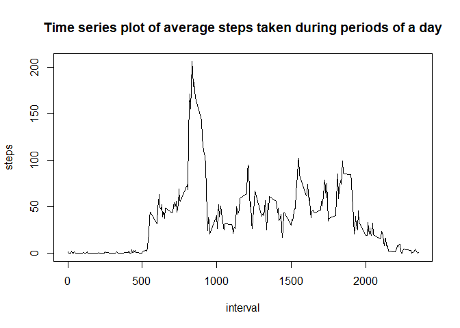
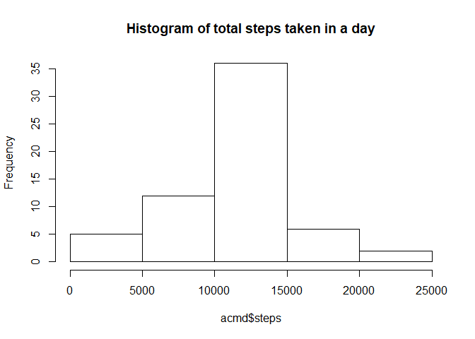
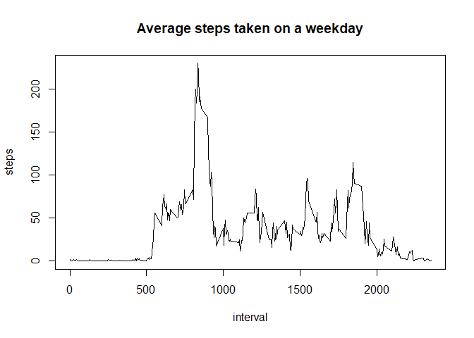
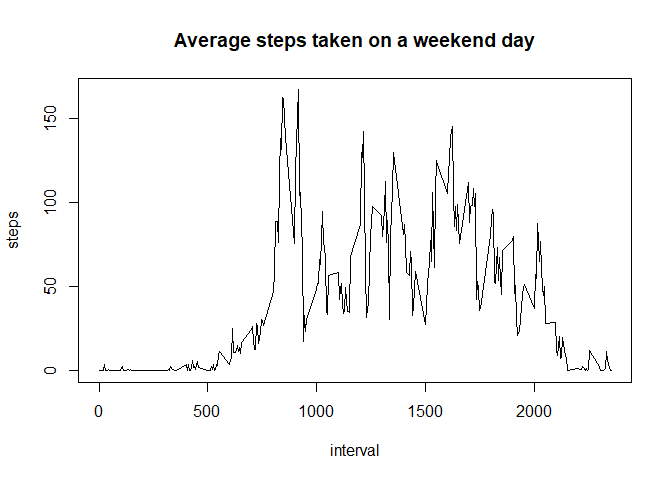

## R Loading and processing the data

The following R code uploads the file "activity.csv" into the variable "ac", loads the dplyr package, and converts its date column from factors into R date formats:


```r
ac<-read.csv("activity.csv")
library(dplyr)
```

```
## Warning: package 'dplyr' was built under R version 3.4.3
```

```
## 
## Attaching package: 'dplyr'
```

```
## The following objects are masked from 'package:stats':
## 
##     filter, lag
```

```
## The following objects are masked from 'package:base':
## 
##     intersect, setdiff, setequal, union
```

```r
ac$date<-as.Date(as.character(ac$date))
```

## What is mean total number of steps taken per day?

The following code first adds up the number of steps taken in a day (after removing the N/A's), plots a historgram of such sums, and then calculates both the mean and the medium of steps taken per day.


```r
acd<-group_by(ac,date) %>% summarize(steps=sum(steps),na.rm=TRUE)
hist(acd$steps,main="Histogram of total steps taken in a day")
```

<!-- -->

```r
mean(acd$steps,na.rm = TRUE)
```

```
## [1] 10766.19
```

```r
median(acd$steps,na.rm = TRUE)
```

```
## [1] 10765
```

## What is the average daily activity pattern?

The following R code takes the average of steps taken during periods of a day and then plots the result in a time series plot. The code then orders the time series averages and selects the first (highest) one and then print out the interval associated with the maximum.  


```r
act<-group_by(ac,interval) %>% summarize(steps=mean(steps,na.rm=TRUE))
plot(act,type="l",main="Time series plot of average steps taken during periods of a day")
```

<!-- -->

```r
x<-order(act$steps,decreasing=TRUE)[1]
act[x,1]
```

```
## # A tibble: 1 x 1
##   interval
##      <int>
## 1      835
```

## Impute missing values.

The following R code addresses the na values in the dataset. The Code first creates a alternative data frame "acm" that is initially a duplicate of ac. It then identifies the na values present in this dataset and sets up an index as to whether they are. It then creates an "impute" functions, which takes a given interval and returns the average steps taken during that interval based on the act variable calculated above. The R code then goes through ACM's na values and replaces each of them with the average steps values of such intervals.


```r
acm<-ac
sum(is.na(acm$steps))
```

```
## [1] 2304
```

```r
index<-which(is.na(acm$steps))
l<-length(index)
impute<-function(int){
  y<-filter(act,interval==int)
  y$steps
}
for (i in 1:l) {
        acm[index[i],1]<-impute(acm[index[i],3])
}
acmd<-group_by(acm,date) %>% summarize(steps=sum(steps),na.rm=TRUE)
hist(acmd$steps,main="Histogram of total steps taken in a day")
```

<!-- -->

```r
mean(acmd$steps,na.rm = TRUE)
```

```
## [1] 10766.19
```

```r
median(acmd$steps,na.rm = TRUE)
```

```
## [1] 10766.19
```
As one can see above, the mean and median values of steps taken per day do not change that much even after the na values were imputed. This phenomenon was perhaps due to the fact that I used the average value for each particular time period to fill in the gap and the old averages were calculated with na.rm=TRUE. Filling the blacks with these averages, thus, merely increased both the numerator and the denominator by the same proportions and should not significantly impact the overall averages.  

## Are there differences in activity patterns between weekdays and weekends?

The following code analyzes the difference between weekday and weekend daily activities leve. The code first classifies "day" into either a weekday or a weekend day using the weekdays() function and the ifelse() function. It then takes the averages of these 2 groups and then plot timelines over the intervals of the day for both weekdays and weekend days.

It seems from the 2 graphs below that, on average, more steps are taken on a weekend day than on a weekday.


```r
acm<- mutate(acm, day = ifelse(weekdays(acm$date) == "Saturday" | weekdays(acm$date) == "Sunday", "weekend", "weekday"))
acmweekday<-filter(acm, day=="weekday")
acmweekend<-filter(acm, day=="weekend")
acmweekday<-group_by(acmweekday,interval)%>% summarize(steps=mean(steps,na.rm=TRUE))
acmweekend<-group_by(acmweekend,interval)%>% summarize(steps=mean(steps,na.rm=TRUE))
plot(acmweekday,type="l",main="Average steps taken on a weekday")
```

<!-- -->

```r
plot(acmweekend,type="l",main="Average steps taken on a weekend day")
```

<!-- -->


